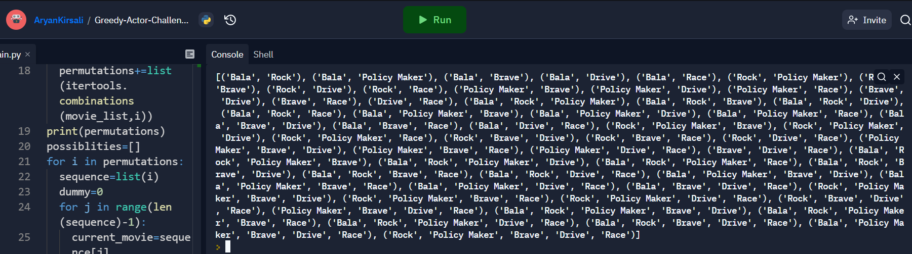

# Greedy-Actor-Challenge-python

## Program breakdown in steps

### adding the movie names in a list named movie_list

### creating combinations of movies

### filtering the combinations and storing only those combinations which satisfy the actor's work conditions

### filtering the filtered combinations and storing only the ones with maximum lengths

### The final output will show all the maximum length combinations containing the movies that the actor can do to earn maximum money

